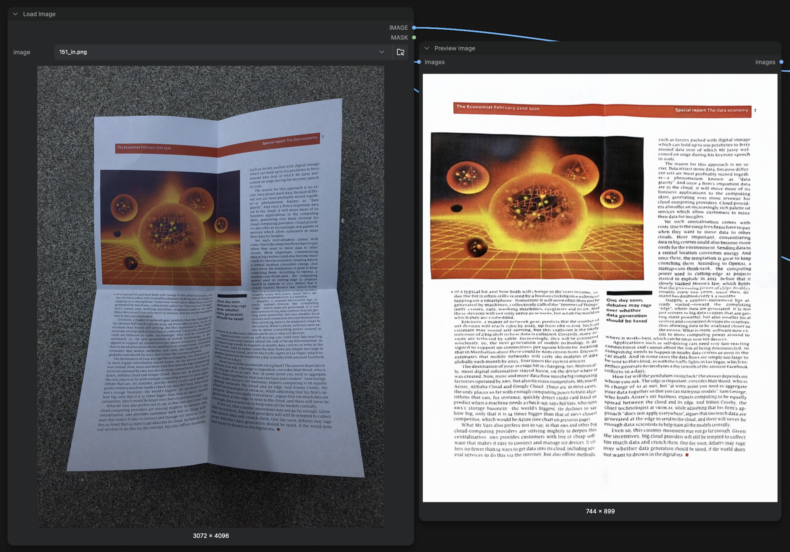
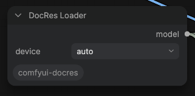
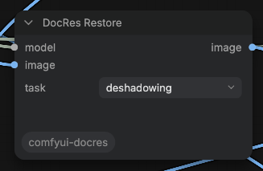
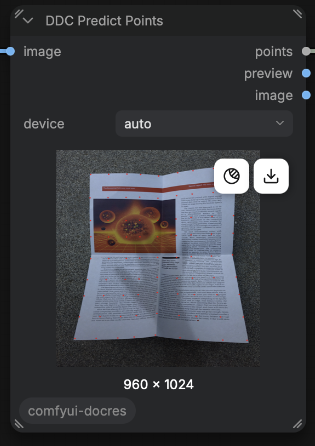
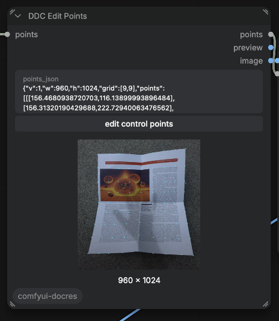
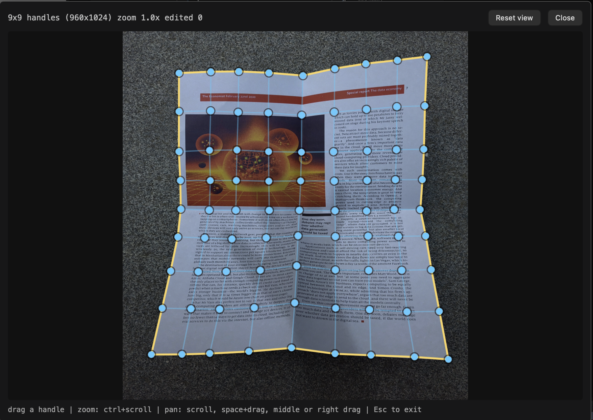
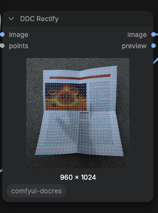

# comfyui-docres

Document image restoration for ComfyUI — straighten curved pages, remove shading and blur, and produce clean black & white scans.

Two independent dewarping paths are included: an automatic one, and one whose control points you can correct by hand when the automatic result isn't good enough.



Everything is inference-only — there is no training code here.

## What it does

| Task | What you get |
|------|--------------|
| **Dewarp** | A curved or folded page flattened back into a rectangle |
| **Deshadow** | Shading, gradients and lighting falloff removed |
| **Appearance** | Contrast, bleed-through and colour cast corrected |
| **Deblur** | Motion and defocus blur sharpened |
| **Binarize** | A clean black & white threshold |

The first four come from a single model ([DocRes](https://arxiv.org/abs/2405.04408)) that handles all of them. Binarization is a separate classical path.

## Technology

**DocRes** — one Restormer backbone covering all four learned tasks. The task is communicated to the network through a 3-channel *prompt* map computed from the input with cheap classical CV, concatenated to the RGB channels. So the same weights do five jobs without retraining.

**DDC control-point dewarping** — a port of [Document-Dewarping-with-Control-Points](https://arxiv.org/abs/2203.10543). The network predicts a grid of control points laid over the page; because those points are plain numbers, you can drag them where you want them before the warp is applied. The warp itself is a thin-plate spline fitted to the grid.

## Install

```bash
cd ComfyUI/custom_nodes
git clone https://github.com/zjkhurry/comfyui-docres.git
pip install -r comfyui-docres/requirements.txt
```

The weights (~335 MB) are **not** in this repo — they download automatically from [Hugging Face](https://huggingface.co/zjkhurry/comfyui-docres-weights) the first time a node needs them, and are cached in `comfyui-docres/weights/`. Nothing to do.

| weights | size | used by |
|---------|------|---------|
| `docres.safetensors` | 58 MB | DocRes Restore |
| `mbd.safetensors` | 227 MB | DocRes Restore — `dewarping` only |
| `ddc_fiducial1024_v1.safetensors` | 51 MB | DDC Predict Points |

Weights already present in `ComfyUI/models/` are used as-is, so you can drop them there instead and nothing will be downloaded.

Restart ComfyUI. All nodes appear under **image/DocRes**.

## Nodes

### DocRes Loader

Loads the weights once and outputs a `model` handle. A single loader can feed a whole chain, so the model is read from disk **once** no matter how many tasks you run.



- **`device`** — `auto` (default), or force `cuda` / `mps` / `cpu`

### DocRes Restore

Applies one task using that handle.



- **`image`** — the distorted scan
- **`task`** — one of `dewarping`, `deshadowing`, `appearance`, `deblurring`, `binarization`
- **`model`** — from DocRes Loader

Wire them like this:

```
LoadImage ─┬─▶ DocRes Restore (dewarping) ─▶ DocRes Restore (deshadowing) ─▶ DocRes Restore (appearance) ─▶ SaveImage
           │
DocRes Loader ── model ─┴──────────────────┴───────────────────────────────┘
```

### DDC Predict Points

Runs the control-point network and outputs the grid.



- **`image`** — the distorted scan
- **`device`** — `auto` (default), or force `cuda` / `mps` / `cpu`

### DDC Edit Points

Shows the grid over your image so you can drag the points. It never runs the network, so adjusting is instant and free.



Open the editor with the **edit control points** button:



| action | how |
|--------|-----|
| move a point | drag it |
| zoom | `ctrl`/`cmd` + scroll, up to 12x |
| pan | scroll, or `space`+drag, middle-drag, right-drag |
| reset the view | **Reset view** button |
| close | `Esc` |

The network predicts 961 points, which is far too many to drag, so the editor works on a 9x9 sample of them and fits the rest of the mesh to match. Points you have moved turn yellow.

Your corrections are stored in the node, so re-running the next node reproduces your warp, and a saved workflow keeps them.

### DDC Rectify

Fits a thin-plate spline to the points and warps the page flat.



- **`image`** — connect the clean `image` output, **not** `preview`, or the dots will be baked into the result

### Which one to use

Dewarping with DocRes is a single forward pass and needs no interaction, so try it first. Reach for the control-point editor when the automatic result bends text or runs off the page. The two are independent and can be chained with the DocRes tasks.

```
LoadImage ─▶ DDC Predict Points ─▶ DDC Edit Points ─▶ DDC Rectify ─▶ SaveImage
```

## Credits

Ported from these projects — please cite them if you use this:

- **DocRes** — [A Generalist Model Toward Unifying Document Image Restoration Tasks](https://arxiv.org/abs/2405.04408)
- **Restormer** — the shared backbone ([paper](https://arxiv.org/abs/2111.09881))
- **Document-Dewarping-with-Control-Points** — the control-point dewarper ([paper](https://arxiv.org/abs/2203.10543), [code](https://github.com/gwxie/Document-Dewarping-with-Control-Points))
- **MBD** — Mask-Based Deepwarping segmentation, used for the page mask in the `dewarping` task ([code](https://github.com/GuYuefei/MBD))

The editor panel follows the modal-editor pattern from [ComfyUI-OpenPose-Studio](https://github.com/andreszs/ComfyUI-OpenPose-Studio).

## License

The ported code follows the licenses of the upstream projects. Weights are redistributed as converted from the originals; check each upstream repository for its terms.
